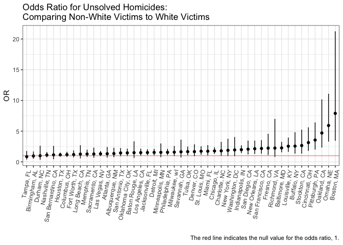
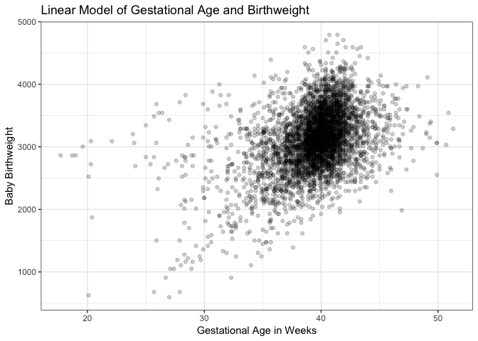
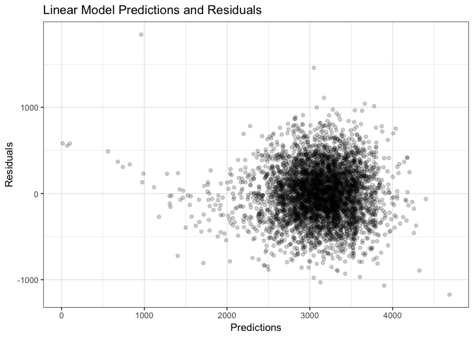
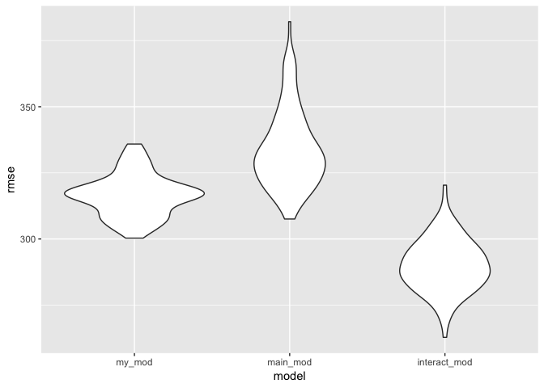

Homework 6
================
Sarah Vititoe
11/19/2018

### Problem 1

*The Washington Post has gathered data on homicides in 50 large U.S. cities and made the data available through a GitHub repository here. You can read their accompanying article here.*

*Create a city\_state variable (e.g. “Baltimore, MD”), and a binary variable indicating whether the homicide is solved. Omit cities Dallas, TX; Phoenix, AZ; and Kansas City, MO – these don’t report victim race. Also omit Tulsa, AL – this is a data entry mistake.*

*Modifiy victim\_race to have categories white and non-white, with white as the reference category. Be sure that victim\_age is numeric.*

#### Coding Case Status

I will code the variable "status", that is 1 if the case is resolved, and 0 otherwise.

``` r
homicides <- read_csv("./data/homicide-data.csv") %>% 
  mutate(city_state = str_c(city, state, sep = ", ")) %>% 
  mutate(status = as.numeric(ifelse(disposition != "Closed by arrest", 1, 0))) %>%
  filter(city_state != "Dallas, Tx" & city_state != "Phoenix, AZ" & city_state != "Kansas City, MO" & city_state != "Tulsa, AL") %>% 
  mutate(race = as.factor(ifelse(victim_race == "White", "White", "Non-White"))) %>% 
  mutate(victim_sex = as.factor(victim_sex)) %>% 
  mutate(race = relevel(race, ref = "White")) %>% 
  mutate(victim_age = as.numeric(victim_age)) %>% 
  select(-victim_last, -victim_first, -disposition, -victim_race) 
```

    ## Parsed with column specification:
    ## cols(
    ##   uid = col_character(),
    ##   reported_date = col_integer(),
    ##   victim_last = col_character(),
    ##   victim_first = col_character(),
    ##   victim_race = col_character(),
    ##   victim_age = col_character(),
    ##   victim_sex = col_character(),
    ##   city = col_character(),
    ##   state = col_character(),
    ##   lat = col_double(),
    ##   lon = col_double(),
    ##   disposition = col_character()
    ## )

    ## Warning in evalq(as.numeric(victim_age), <environment>): NAs introduced by
    ## coercion

*"For the city of Baltimore, MD, use the glm function to fit a logistic regression with resolved vs unresolved as the outcome and victim age, sex and race (as just defined) as predictors."*

``` r
baltimore <- homicides %>% 
  filter(city_state == "Baltimore, MD")

balt_lm <- glm(status ~ victim_age + victim_sex + race, data = baltimore, family = "binomial") %>% 
  broom::tidy()
```

*"Save the output of glm as an R object; apply the broom::tidy to this object; and obtain the estimate and confidence interval of the adjusted odds ratio for solving homicides comparing non-white victims to white victims keeping all other variables fixed."*

``` r
balt_tidy <- baltimore %>% 
  select(victim_age, victim_sex, city_state, race, status) %>% 
  mutate(status = as.factor(status)) %>% 
  filter(victim_sex != "Unknown") %>% 
  group_by(city_state) %>% 
  nest() %>% 
  mutate(models = map(data, ~glm(status ~ victim_age + victim_sex + race, data = .x, family = binomial))) %>%
  mutate(models_tidy = map(models, ~broom::tidy(.))) %>% 
  mutate(models_ci = map(models, ~broom::confint_tidy(.))) %>% 
  select(city_state, models_tidy, models_ci) %>% 
  unnest %>% 
  filter(term == "raceNon-White")
```

Our estimate of the odds ratio for unresolved homicides is 2.27, comparing non-Whites to Whites. We are 95% confident that the true odds ratio for unsolved homicides, comparing non-Whites to whites is (1.614, 3.203).

*"Now run glm for each of the cities in your dataset, and extract the adjusted odds ratio (and CI) for solving homicides comparing non-white victims to white victims. Do this within a “tidy” pipeline, making use of purrr::map, list columns, and unnest as necessary to create a dataframe with estimated ORs and CIs for each city."*

``` r
homicides_or <- homicides %>% 
  select(victim_age, victim_sex, city_state, race, status) %>% 
  mutate(status = as.factor(status)) %>% 
  filter(victim_sex != "Unknown") %>% 
  group_by(city_state) %>% 
  nest() %>% 
  mutate(models = map(data, ~glm(status ~ victim_age + race + victim_sex, data = .x, family = binomial))) %>%
  mutate(models_tidy = map(models, ~broom::tidy(.))) %>% 
  mutate(models_ci = map(models, ~broom::confint_tidy(.))) %>% 
  select(city_state, models_tidy, models_ci) %>% 
  unnest() %>% 
  mutate(OR = exp(estimate), OR.conf.low = exp(conf.low), OR.conf.high = exp(conf.high)) %>% 
  filter(term == "raceNon-White") %>% 
  select(city_state, starts_with("OR"))
```

*"Create a plot that shows the estimated ORs and CIs for each city. Organize cities according to estimated OR, and comment on the plot."*

``` r
homicides_or %>% 
  mutate(city_state = reorder(city_state, OR)) %>% 
  ggplot(aes(x = city_state, y = OR)) +
    geom_errorbar(aes(ymin = OR.conf.low, ymax = OR.conf.high), width = .1) +
    geom_point() + 
    labs(
      title = "Odds Ratio for Unsolved Homicides: \nComparing Non-White Victims to White Victims", 
      y = "OR",
      x = "", 
      caption = "The red line indicates the null value for the odds ratio, 1."
    ) +
    geom_hline(yintercept = 1, color = "red", alpha = 0.5) +
    theme_bw() + 
    theme(legend.position = "bottom", axis.text.x = element_text(angle = 80, hjust = 1))
```



### Problem 2

In this probelm, you will analyze data gathered to understand the effects of several variables on a child’s birthweight. This dataset, available here, consists of roughly 4000 children and includes the following variables:

babysex: baby’s sex (male = 1, female = 2) bhead: baby’s head circumference at birth (centimeters) blength: baby’s length at birth (centimeteres) bwt: baby’s birth weight (grams) delwt: mother’s weight at delivery (pounds) fincome: family monthly income (in hundreds, rounded) frace: father’s race (1= White, 2 = Black, 3 = Asian, 4 = Puerto Rican, 8 = Other, 9 = Unknown) gaweeks: gestational age in weeks malform: presence of malformations that could affect weight (0 = absent, 1 = present) menarche: mother’s age at menarche (years) mheigth: mother’s height (inches) momage: mother’s age at delivery (years) mrace: mother’s race (1= White, 2 = Black, 3 = Asian, 4 = Puerto Rican, 8 = Other) parity: number of live births prior to this pregnancy pnumlbw: previous number of low birth weight babies pnumgsa: number of prior small for gestational age babies ppbmi: mother’s pre-pregnancy BMI ppwt: mother’s pre-pregnancy weight (pounds) smoken: average number of cigarettes smoked per day during pregnancy wtgain: mother’s weight gain during pregnancy (pounds) Load and clean the data for regression analysis (i.e. convert numeric to factor where appropriate, check for missing data, etc.).

I'll start off by recoding race into "white" and "non-white" categories

``` r
babies <- read_csv("./data/birthweight.csv") %>% 
  mutate(frace = ifelse(frace == "9", NA, frace)) %>% 
  mutate_at(vars(babysex, malform, frace, mrace), funs(as.factor)) 
```

    ## Parsed with column specification:
    ## cols(
    ##   .default = col_integer(),
    ##   gaweeks = col_double(),
    ##   ppbmi = col_double(),
    ##   smoken = col_double()
    ## )

    ## See spec(...) for full column specifications.

``` r
babies %>% 
  summarise_all(funs(sum(is.na(.)))) %>% 
  glimpse
```

    ## Observations: 1
    ## Variables: 20
    ## $ babysex  <int> 0
    ## $ bhead    <int> 0
    ## $ blength  <int> 0
    ## $ bwt      <int> 0
    ## $ delwt    <int> 0
    ## $ fincome  <int> 0
    ## $ frace    <int> 0
    ## $ gaweeks  <int> 0
    ## $ malform  <int> 0
    ## $ menarche <int> 0
    ## $ mheight  <int> 0
    ## $ momage   <int> 0
    ## $ mrace    <int> 0
    ## $ parity   <int> 0
    ## $ pnumlbw  <int> 0
    ## $ pnumsga  <int> 0
    ## $ ppbmi    <int> 0
    ## $ ppwt     <int> 0
    ## $ smoken   <int> 0
    ## $ wtgain   <int> 0

We have no missing values.

*"Propose a regression model for birthweight. This model may be based on a hypothesized structure for the factors that underly birthweight, on a data-driven model-building process, or a combination of the two."*

``` r
library(modelr) 
library(mgcv) 
```

    ## Loading required package: nlme

    ## 
    ## Attaching package: 'nlme'

    ## The following object is masked from 'package:dplyr':
    ## 
    ##     collapse

    ## This is mgcv 1.8-24. For overview type 'help("mgcv-package")'.

``` r
set.seed(23)
```

I will be sticking only to factors about the pregnancy that are known during the third trimester (before the baby's birth); while I'm sure the baby's length is an excellent predictor of weight, that wouldn't be a clinically useful predictor.

Based off what I know about birthweight, I imagine that the baby's gestational age is the most important factor of birthweight. Other important factors would include the baby sex, mother's pre-pregnancy BMI, weight gain during pregancy, parity and baby's head circumference.

Since I'm using pre-pregnancy BMI as a predictor, I will not use pre-pregnancy weight, or mother's height as predictors. I will also not use weight at delivery, since I am using weight gain during pregancy as a predictor. I will not use baby length, since this is difficult to measure during pregnancy, and is a proxy for gestational age. Confounders that would be interesting to look at would include smoking, paternal and maternal race, income, malformations, mom's age, and mom's age at menarche.

I will use a linear model, since I am more familiar model selection for linear models. I will do backwards selection, where I will remove the variable with the highest p-values until I get a model with only significant values. I will use a cutoff value of alpha = 0.05 for variable selection, so that if a variable significantly affects my predictions in non-linear models, but is not significant in my linear model, I can see this when I compare my models.

``` r
lin_mod_babies <- lm(bwt ~ gaweeks + bhead + babysex + fincome + frace + malform + menarche + momage + mrace + parity + ppbmi + smoken + wtgain, data = babies)

lin_mod_babies %>% broom::tidy() %>% filter(p.value > 0.05) %>% arrange(desc(p.value))
```

    ## # A tibble: 10 x 5
    ##    term     estimate std.error statistic p.value
    ##    <chr>       <dbl>     <dbl>     <dbl>   <dbl>
    ##  1 frace2      4.36     53.6      0.0814  0.935 
    ##  2 frace3     32.8      80.5      0.408   0.683 
    ##  3 frace8    -42.1      86.0     -0.489   0.625 
    ##  4 malform1  -43.6      82.0     -0.531   0.595 
    ##  5 frace4    -32.2      51.9     -0.621   0.535 
    ##  6 momage      1.17      1.42     0.827   0.408 
    ##  7 fincome     0.175     0.208    0.841   0.401 
    ##  8 menarche   -3.81      3.36    -1.14    0.256 
    ##  9 parity     67.4      47.0      1.43    0.152 
    ## 10 mrace3   -138.       83.4     -1.65    0.0985

None of the dummy variables for the father's race seems to not be a significant predictor of baby's birthweight, so we'll remove this from our model.

``` r
lin_mod_babies <- lm(bwt ~ gaweeks + bhead + babysex + fincome + malform + menarche + momage + mrace + parity + ppbmi + smoken + wtgain, data = babies)

lin_mod_babies %>% broom::tidy() %>% filter(p.value > 0.05) %>% arrange(desc(p.value))
```

    ## # A tibble: 5 x 5
    ##   term     estimate std.error statistic p.value
    ##   <chr>       <dbl>     <dbl>     <dbl>   <dbl>
    ## 1 malform1  -43.3      82.0      -0.529   0.597
    ## 2 momage      1.20      1.41      0.845   0.398
    ## 3 fincome     0.179     0.207     0.861   0.389
    ## 4 menarche   -3.86      3.35     -1.15    0.250
    ## 5 parity     67.5      47.0       1.44    0.151

Malformations is the next least-significant. Let's remove this predictor.

``` r
lin_mod_babies <- lm(bwt ~ gaweeks + bhead + babysex + fincome + menarche + momage + mrace + parity + ppbmi + smoken + wtgain, data = babies)

lin_mod_babies %>% broom::tidy() %>% filter(p.value > 0.05) %>% arrange(desc(p.value))
```

    ## # A tibble: 4 x 5
    ##   term     estimate std.error statistic p.value
    ##   <chr>       <dbl>     <dbl>     <dbl>   <dbl>
    ## 1 momage      1.18      1.41      0.835   0.404
    ## 2 fincome     0.181     0.207     0.873   0.383
    ## 3 menarche   -3.84      3.35     -1.14    0.252
    ## 4 parity     67.6      47.0       1.44    0.151

We'll remove mom's age.

``` r
lin_mod_babies <- lm(bwt ~ gaweeks + bhead + babysex + fincome + menarche + mrace + parity + ppbmi + smoken + wtgain, data = babies)

lin_mod_babies %>% broom::tidy() %>% filter(p.value > 0.05) %>% arrange(desc(p.value))
```

    ## # A tibble: 3 x 5
    ##   term     estimate std.error statistic p.value
    ##   <chr>       <dbl>     <dbl>     <dbl>   <dbl>
    ## 1 menarche   -3.29      3.29      -1.00   0.317
    ## 2 fincome     0.220     0.202      1.09   0.277
    ## 3 parity     70.4      46.9        1.50   0.133

Remove menarche.

``` r
lin_mod_babies <- lm(bwt ~ gaweeks + bhead + babysex + fincome + mrace + parity + ppbmi + smoken + wtgain, data = babies)

lin_mod_babies %>% broom::tidy() %>% filter(p.value > 0.05) %>% arrange(desc(p.value))
```

    ## # A tibble: 2 x 5
    ##   term    estimate std.error statistic p.value
    ##   <chr>      <dbl>     <dbl>     <dbl>   <dbl>
    ## 1 fincome    0.221     0.202      1.10   0.273
    ## 2 parity    69.4      46.9        1.48   0.139

Remove financial income

``` r
lin_mod_babies <- lm(bwt ~ gaweeks + bhead + babysex + mrace + parity + ppbmi + smoken + wtgain, data = babies)

lin_mod_babies %>% broom::tidy() %>% filter(p.value > 0.05) %>% arrange(desc(p.value))
```

    ## # A tibble: 1 x 5
    ##   term   estimate std.error statistic p.value
    ##   <chr>     <dbl>     <dbl>     <dbl>   <dbl>
    ## 1 parity     68.3      46.8      1.46   0.145

Remove parity.

``` r
lin_mod_babies <- lm(bwt ~ gaweeks + bhead + babysex + mrace + ppbmi + smoken + wtgain, data = babies)

lin_mod_babies %>% broom::glance() %>% arrange(desc(p.value))
```

    ## # A tibble: 1 x 11
    ##   r.squared adj.r.squared sigma statistic p.value    df  logLik    AIC
    ##       <dbl>         <dbl> <dbl>     <dbl>   <dbl> <int>   <dbl>  <dbl>
    ## 1     0.619         0.618  316.      782.       0    10 -31153. 62328.
    ## # ... with 3 more variables: BIC <dbl>, deviance <dbl>, df.residual <int>

Add interaction

``` r
lin_mod_babies <- lm(bwt ~ (gaweeks + bhead + babysex + mrace + ppbmi + smoken + wtgain)^2, data = babies)

lin_mod_babies %>% broom::glance() %>% arrange(desc(p.value))
```

    ## # A tibble: 1 x 11
    ##   r.squared adj.r.squared sigma statistic p.value    df  logLik    AIC
    ##       <dbl>         <dbl> <dbl>     <dbl>   <dbl> <int>   <dbl>  <dbl>
    ## 1     0.630         0.626  313.      174.       0    43 -31091. 62271.
    ## # ... with 3 more variables: BIC <dbl>, deviance <dbl>, df.residual <int>

*Describe your modeling process and show a plot of model residuals against fitted values – use add\_predictions and add\_residuals in making this plot.*

``` r
babies %>% 
  ggplot(aes(x = gaweeks, y = bwt)) + 
  geom_point(alpha = 0.2) + 
  labs(
      title = "Linear Model of Gestational Age and Birthweight", 
      y = "Baby Birthweight",
      x = "Gestational Age in Weeks"
    ) +
    theme_bw() + 
    theme(legend.position = "bottom")
```



``` r
babies %>% 
  modelr::add_predictions(lin_mod_babies) %>% 
  modelr::add_residuals(lin_mod_babies) %>% 
  ggplot(aes(x = pred, y = resid)) + 
  geom_point(alpha = 0.2) + 
  labs(
    title = "Linear Model Predictions and Residuals",
    y = "Residuals",
    x = "Predictions"
     ) + 
    theme_bw() + 
    theme(legend.position = "bottom")
```



Our residuals seem to be relatively constant over the range of predictions.

*Compare your model to two others:*

*One using length at birth and gestational age as predictors (main effects only)*

*One using head circumference, length, sex, and all interactions (including the three-way interaction) between these*

*Make this comparison in terms of the cross-validated prediction error; use crossv\_mc and functions in purrr as appropriate.*

``` r
cv_babies <- babies %>% 
  crossv_mc(100) %>% 
  mutate(train = map(train, as_tibble),
         test = map(test, as_tibble))
```

``` r
cv_babies_compare <- cv_babies %>% 
  mutate(my_mod = map(train, ~lm(bwt ~ (gaweeks + bhead + babysex + mrace + ppbmi + smoken + wtgain)^2, data = .x)),
         main_mod = map(train, ~lm(bwt ~ gaweeks + blength, data = .x)),
         interact_mod = map(train, ~lm(bwt ~ bhead * blength * babysex, data = .x))) %>% 
  mutate(rmse_my_mod    = map2_dbl(my_mod, test, ~rmse(model = .x, data = .y)),
         rmse_main_mod = map2_dbl(main_mod, test, ~rmse(model = .x, data = .y)),
         rmse_interact_mod = map2_dbl(interact_mod, test, ~rmse(model = .x, data = .y)))
```

    ## Warning in predict.lm(model, data): prediction from a rank-deficient fit
    ## may be misleading

    ## Warning in predict.lm(model, data): prediction from a rank-deficient fit
    ## may be misleading

``` r
cv_babies_compare %>% 
  select(starts_with("rmse")) %>% 
  gather(key = model, value = rmse) %>% 
  mutate(model = str_replace(model, "rmse_", ""),
         model = fct_inorder(model)) %>% 
  ggplot(aes(x = model, y = rmse)) + 
  geom_violin()
```



My model is better than just the main effect, but not as good as the interaction model.
